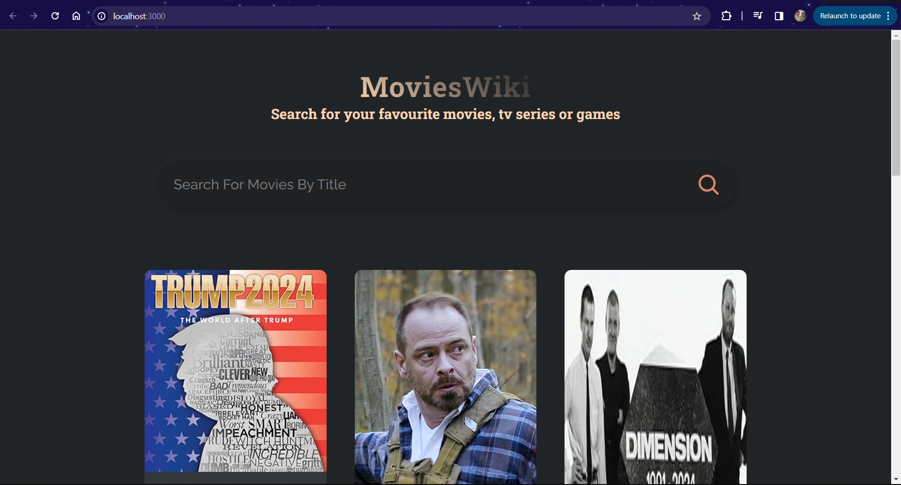
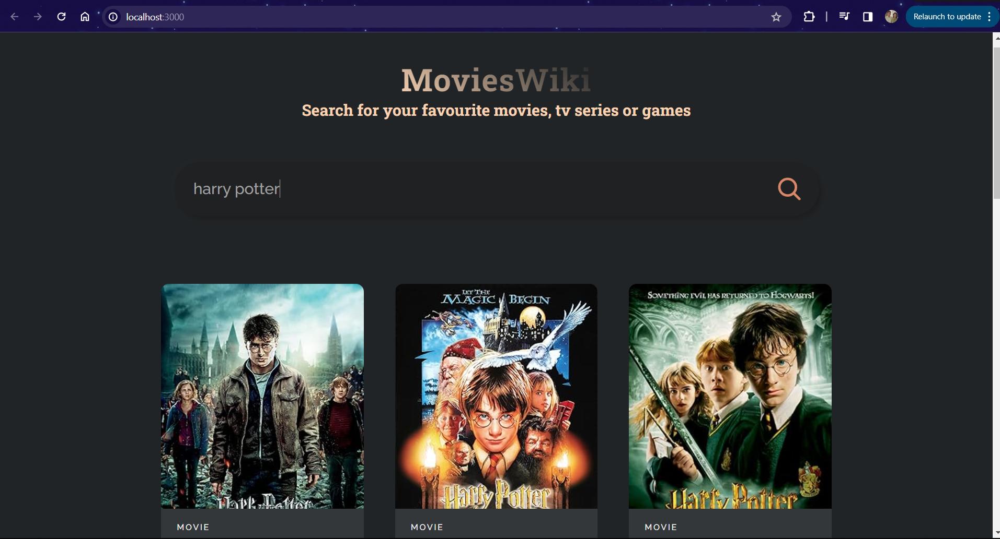
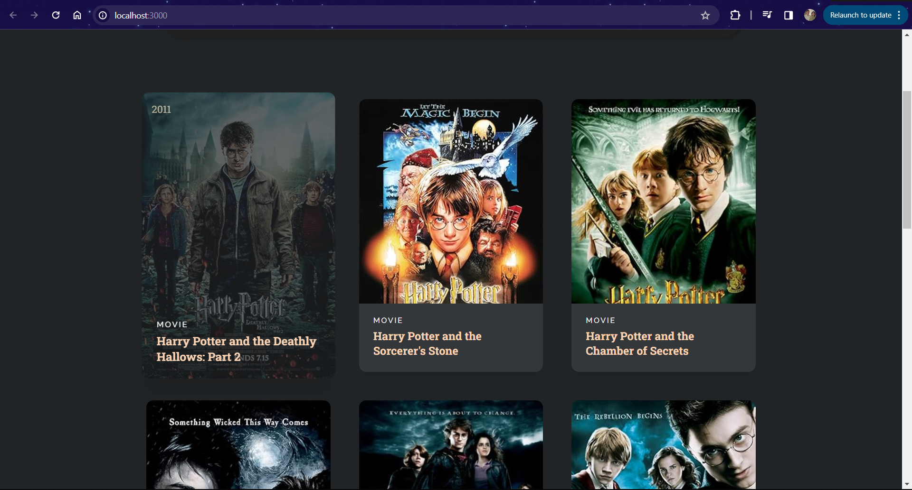

# MoviesWiki 🎬

MoviesWIki is a movie search application built with React that allows users to explore and discover movies by title. Whether you're looking for your favorite films or want to discover new titles, MovieLand makes it easy!

## Features

- **Search by Title:** Easily search for movies by entering their titles.
- **Detailed Movie Information:** Hover over a movie card to view detailed information, including the poster, release year, type, and more.
- **Responsive Design:** MoviesWiki is designed to work seamlessly on various devices, providing a great user experience.

## How to Use

1. **Clone the Repository:**
   ```bash
   git clone https://github.com/your-username/MovieLand.git
   ```

2. **Install Dependencies:**
   ```bash
   cd MovieLand
   npm install
   ```

3. **Run the App:**
   ```bash
   npm start
   ```

   The app will be running at `http://localhost:3000`.

## Technologies Used

- React
- JavaScript
- CSS (with Tailwind CSS for styling)
- OMDB API for movie data

## Screenshots





## Contributions

Contributions are welcome! Feel free to open issues and pull requests.

---

Feel free to customize the content further, and if you have any specific details or sections you'd like to include, let me know!
